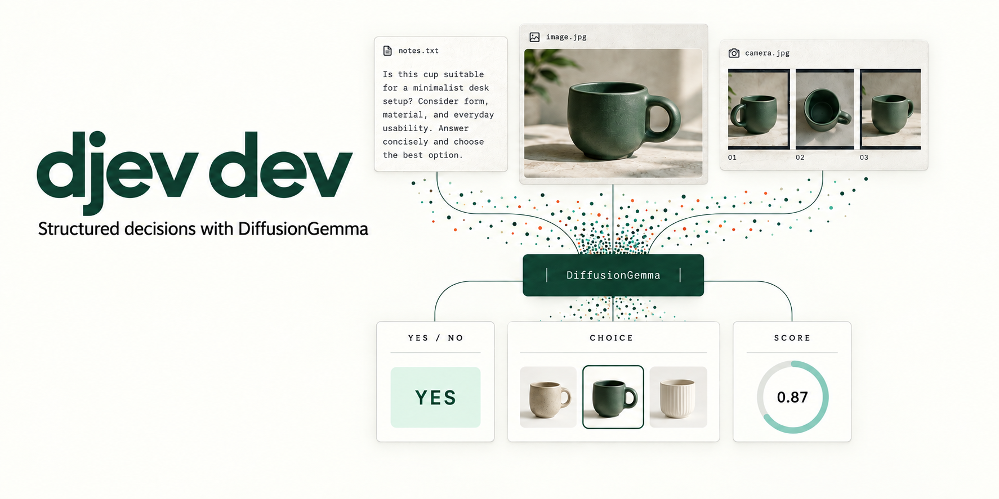
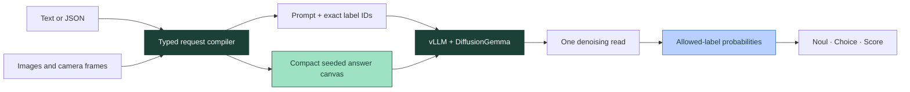

<p align="center">
  
</p>

<p align="center">
  <strong>Text in. Images in. Decisions out.</strong><br />
  An open implementation of small, typed decisions on DiffusionGemma + vLLM.
</p>

<p align="center">
  <a href="#quick-start">Run it</a> ·
  <a href="docs/architecture.md">Architecture</a> ·
  <a href="docs/runtime.md">GPU setup</a> ·
  <a href="docs/performance.md">Performance</a> ·
  <a href="docs/api.md">API</a>
</p>

## A different use for a diffusion model

Most applications do not need a paragraph. They need to decide whether a ticket is urgent, which object matches a reference, or where a sample falls on a rubric.

**djev dev** turns those questions into a compact answer canvas. DiffusionGemma reads the context and denoises the answer positions together. The API reads the probabilities of the allowed labels directly, then constructs a validated response. It avoids generating and reparsing a prose answer or a JSON document token by token.

The core is [Google's DiffusionGemma](https://huggingface.co/google/diffusiongemma-26B-A4B-it), adapted for structured reads through [vLLM](https://github.com/vllm-project/vllm) and the upstream work in [PR #57250](https://github.com/vllm-project/vllm/pull/57250). This repository adds a typed decision layer, multimodal integration, targeted runtime fixes, and a local playground. It does not introduce new model weights or claim to have trained DiffusionGemma.

| Capability | What you can build |
| --- | --- |
| **Noul · yes/no** | Routing gates, visual checks, condition detection |
| **Choice · named options** | Intent routing, sorting, matching, product selection |
| **Score · an ordered rubric** | Quality ratings with a distribution across explicit levels |
| **Native image input** | Evaluate the actual image through the model's vision encoder |
| **Images as options** | Pick between pictures; each option can be text, an image, or both |
| **Live camera input** | Watch a preview while successive frames are evaluated with backpressure |

Camera mode samples frames and makes image requests. It does not maintain temporal memory or promise a fixed video frame rate.

## The inference path



The speed comes from doing less output work, then keeping the serving path short:

- **One-step structured reads.** Inspect the answer slots without running a full conversational generation loop.
- **Compact canvases.** Round the required answer template to a small supported width instead of always denoising a full canvas.
- **Exact label probabilities.** Read the requested token IDs directly, including large choice sets; do not depend on the answer appearing in a small top-k list.
- **Reusable text prefixes.** Reuse compiled schemas and eligible KV prefixes. The schema cache is not an answer cache.
- **Native multimodal attention.** Preserve image patch visibility, admit complete image spans, and carry option images into the same model call.
- **Deliberate batching.** Bound outstanding work, keep the GPU warm, and measure tail latency as concurrency rises.

See the [implementation walkthrough and patch map](docs/architecture.md) for what comes from upstream and what this repository changes.

## Quick start

Recommended reference hardware: **one NVIDIA B200, Linux, CUDA 13**. The runtime uses the original checkpoint with **BF16 weights and BF16 KV cache**, without weight quantization. Start with the [pinned GPU setup](docs/runtime.md); stock vLLM alone does not provide all the required structured-read and image fixes.

```bash
git clone https://github.com/Davipar/djev-dev.git
cd djev-dev
cd playground
npm ci
npm run build
cd ..
docker build -f runtime/Dockerfile -t djev-local .
docker run -d --name djev-model \
  --gpus device=0 --shm-size=16g \
  -p 127.0.0.1:8000:8000 \
  -v djev-model-cache:/cache \
  -v "$PWD/playground/dist:/opt/djev/playground/dist:ro" \
  djev-local
```

Use Node 22.12+ for the playground build. The first model start downloads weights and compiles kernels; allow several minutes and follow `docker logs -f djev-model`. Once the model reports ready, start the API:

```bash
docker exec -d djev-model python3 -m djev --host 0.0.0.0 --port 8000
curl --fail http://127.0.0.1:8000/ready
```

Open **http://127.0.0.1:8000**. The playground has visual and JSON question editors, image uploads, image choices, a live camera preview, and copyable cURL/Python/TypeScript requests. It uses the local API; no hosted account is required. The [runtime guide](docs/runtime.md) also covers a separate Python development process, shutdown, tuning, and multi-replica layouts.

### Your first decision

```bash
curl http://127.0.0.1:8000/v1/request \
  -H 'Content-Type: application/json' \
  -d '{
    "state": "The checkout is down. Customers cannot pay.",
    "questions": {
      "urgent": {
        "type": "noul",
        "instructions": "Does this need immediate attention?"
      },
      "team": {
        "type": "choice",
        "instructions": "Which team should handle this?",
        "criteria": {
          "billing": "Charges, invoices, and refunds",
          "engineering": "Broken features and outages",
          "other": "Anything else"
        }
      }
    }
  }'
```

For image choices, replace a criterion description with an image object:

```json
{
  "type": "choice",
  "instructions": "Which option most closely matches the reference object's form?",
  "criteria": {
    "cup_a": {"image": "data:image/png;base64,...", "text": "Option A"},
    "cup_b": {"image": "data:image/png;base64,...", "text": "Option B"}
  }
}
```

The abbreviated data URLs above illustrate the shape; use actual base64 image bytes. Put the reference image in the request's `images` array. The [API guide](docs/api.md) includes a complete file-to-request example.

## Performance, cost, and external validation

The structured-read approach has produced **sub-100 ms warm text responses in internal measurements**. Hardware, precision, input size, concurrency, and the measurement boundary matter: the historical 1,000-request text run reached **76.87 ms p50 / 86.40 ms p95**, using an earlier quantized configuration. Those numbers are **not a benchmark of this BF16 release** and do not apply to image requests.

We publish the measurement scope, current limitations, and a reproduction protocol in [Performance](docs/performance.md). A universal 2.5× speedup requires a named, matched baseline; independent comparisons are welcome. We are also looking for held-out evaluations of answer quality, image matching, calibration, and repeated-request stability.

There is no per-token software charge for this open-source implementation. Compute cost depends on useful throughput and utilization. The economics guide explains the **$35 per billion input-token target**, how to calculate break-even capacity, and why adding machines only helps when they stay productively busy.

## Explore the code

| Location | Responsibility |
| --- | --- |
| [`djev/contracts.py`](djev/contracts.py) | Request limits, question types, probability-to-answer conversion |
| [`djev/engine.py`](djev/engine.py) | Schema compilation, seeded canvases, exact-label reads, batching |
| [`djev/multimodal.py`](djev/multimodal.py) | Native multimodal preflight and model messages |
| [`runtime/`](runtime/) | Pinned vLLM sources, runtime patching, GPU startup |
| [`playground/`](playground/) | Vite playground, image choices, camera sampling |
| [`tests/`](tests/) | CPU contract, runtime-patch, and browser-logic tests |

This is a focused inference building block. Production account management, payments, private infrastructure, credentials, and operational history are not included. Keep the raw model server private; see [Security](SECURITY.md) before exposing an instance.

## Contribute

Bring a reproducible workload, a named baseline, or a failing case. Especially useful: mixed text/image concurrency, stable Score distributions, image-choice ordering, and throughput at a fixed latency budget. See [CONTRIBUTING.md](CONTRIBUTING.md).

## License and credits

Apache-2.0. See [LICENSE](LICENSE) and [NOTICE](NOTICE). Thanks to Google DeepMind for DiffusionGemma, the vLLM contributors, and [Matthew Mastracci](https://github.com/mmastrac) for the structured-generation work that this implementation builds on. Model weights are downloaded separately and retain their upstream license and notices. No affiliation or endorsement is implied.
