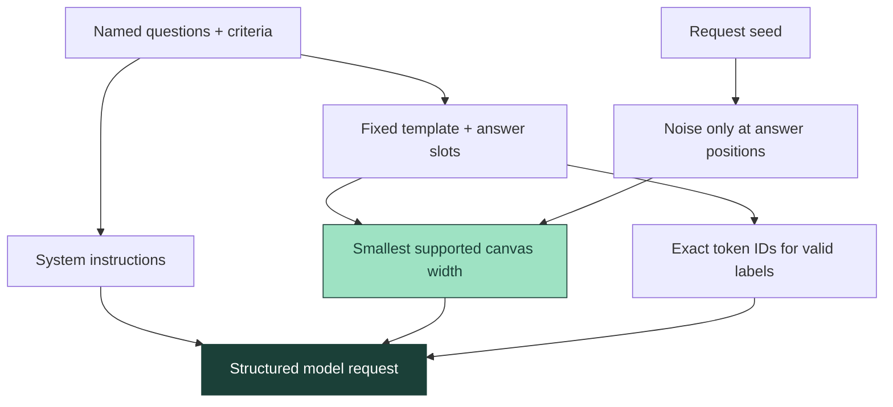
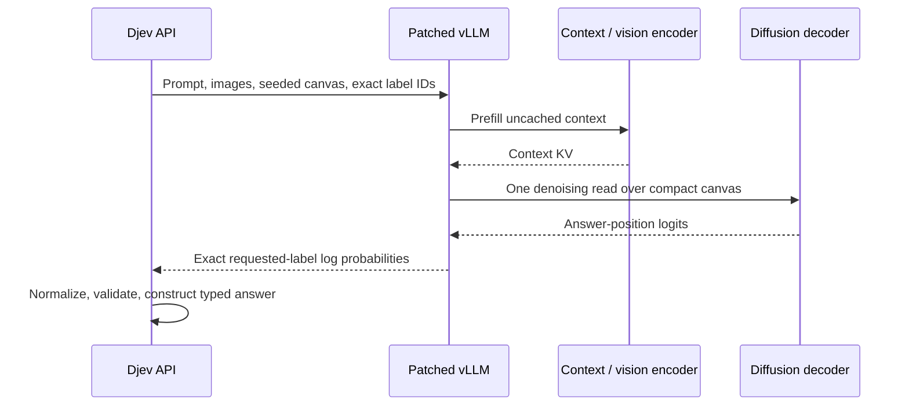
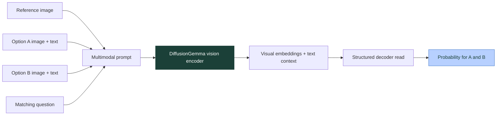
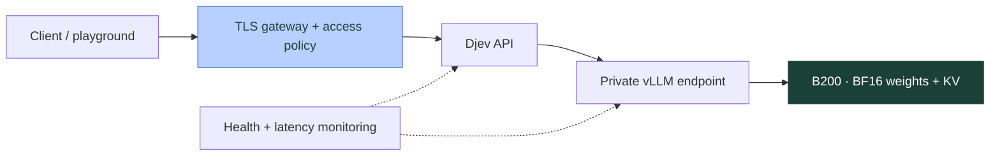

# How djev dev works

Djev compiles a bounded question into a small model read. Its output contract is decided before inference: two labels for Noul, one label per Choice option, or one label per Score level. The application gets probabilities and typed values rather than free-form prose.

## 1. Compile the question, not the answer

`contracts.py` validates the state, descriptions, image attachments, and question limits. `engine.py` turns the question definitions into instructions plus a fixed answer template. Literal template tokens stay fixed; answer positions are initialized from a seeded noise sequence.

The text schema cache holds compiled question definitions. It does not cache answers. Native image descriptions bypass that shared schema cache so image bytes remain request-local. In independent mode, each question gets its own read and a seed derived from its content; adding an unrelated question does not change that focal question's compiled prompt. This structural isolation is not a promise of bitwise-identical GPU arithmetic across batches.

## 2. Read the diffusion canvas once

DiffusionGemma has an encoder that prefills the context and a decoder that attends bidirectionally across a token canvas. Ordinary generation repeatedly denoises canvases to produce text. Djev's default path uses the structured-read extension to inspect label probabilities after one denoising step.

The important optimization is avoiding unnecessary work after the decision evidence exists. The runtime does not need to generate a natural-language explanation, close a JSON document, or commit a completed canvas for another generation round. Upstream structured-read support provides much of this execution path; Djev supplies the contract and integration around it.

This is an inference adaptation, not fine-tuning. It trades the model's full iterative reasoning process for a small decision read. Complex tasks can need a different model or more compute. Multiple samples average separate one-step reads; they are not extra denoising steps on the same canvas.

## 3. Images enter the model, including option images

Images are decoded and bounded before inference. State images, question images, and option images become native multimodal message parts, with textual references preserving which image belongs to which choice.

No separate captioning model converts the image into a lossy text proxy. The runtime patches preserve bidirectional attention within image spans, prevent partial image prefill, and avoid unsafe prefix reuse for image requests. Together these address correctness problems that a frontend upload button alone cannot solve.

The request supports one state image and up to six attachment occurrences across the complete request. Reusing the same bytes in two option descriptions still counts as two image occurrences. Uploaded images must be JPEG, PNG, or WebP within the documented size limits. Remote URL fetching is intentionally absent.

## 4. Turn evidence into a contract

| Type | Returned decision |
| --- | --- |
| Noul | Probability assigned to `true` and its complement |
| Choice | Probability distribution over the caller's named options |
| Score | Probability distribution over the ordered levels and its expected zero-based index |

Only allowed-label probabilities are normalized into the decision distribution. This makes the response structurally reliable; it does not establish semantic correctness. Entropy-derived `confidence` measures concentration, not calibrated real-world accuracy. More concentrated predictions can still be wrong.

## vLLM change map

The build verifies exact source hashes and applies a small, pinned overlay. It fails on an unexpected source version rather than guessing where to patch. See [`runtime/sources.json`](../runtime/sources.json) and the [runtime guide](runtime.md).

| Layer | Change | Purpose / provenance |
| --- | --- | --- |
| Request parameters | Seed canvas, canvas width, read-only structured mode | Upstream structured-generation work |
| Scheduler and model runner | Respect structured canvas scheduling and return the read | Upstream structured-generation work |
| Diffusion model | Read requested answer-label probabilities without full generation | Upstream structured-generation work |
| Vision attention | Preserve image-span visibility during prefill | Djev runtime integration |
| Multimodal scheduling | Admit complete images; account for multiple attachments | Djev runtime integration |
| Prefix handling | Bypass image prefix reuse where unsafe | Djev runtime integration |
| Attention dispatch | Preserve the intended batch-invariant path | Djev runtime integration; does not solve every numerical repeatability issue |
| Application compiler | Typed questions, label mapping, compact canvases, native option images | Djev |

## Live camera loop

The browser requests camera access only when the user starts it. A preview stays visible. Each completed evaluation allows the next frame to be captured; an interval cannot build an unbounded queue of stale frames. Stopping the camera releases the tracks. In-flight work can finish, but it must not restart the loop.

This is useful for changing visual state: an object entering view, a label facing the camera, or a reference match. Temporal reasoning across earlier frames is outside this basic implementation.

## Recommended serving layout

Keep the API close to the GPU and the user population, reuse connections, and warm the actual text and image shapes you intend to serve. Start with one replica and measure it before choosing a pool size. A larger pool increases capacity; it does not remove long network paths or make an individual image prefill free.
