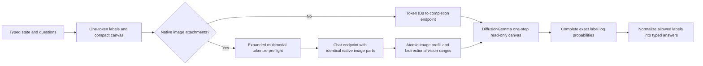

# Running the model

The API is a small Python service; the actual model runs in a separate vLLM process. The supplied GPU image contains a source-pinned vLLM composite with native image attention, complete label log probabilities, and a consistent attention-dispatch path. It uses **BF16 weights and BF16 KV cache**, with no weight quantization or reduced-precision image attention override.

Use a Linux host with one NVIDIA B200, an NVIDIA driver compatible with CUDA 13, and the NVIDIA Container Toolkit. A practical starting configuration is 16 vCPUs, 128 GiB system RAM, and at least 100 GiB of fast persistent storage for weights and caches. GPU memory includes the model, image encoder, KV cache, and compilation workspaces; the 26B-parameter model's BF16 weights alone are roughly 52 GB. These are setup recommendations, not a resource-minimum benchmark.

This release supports **one GPU per model process**. For images, tensor, pipeline, data, and context parallel sizes must all be one. Unsupported distributed image configurations fail before inference. Scale with independent replicas rather than adding tensor-parallel flags.

## Reproducible sources

| Component | Pin |
| --- | --- |
| Base image | `vllm/vllm-openai:nightly-dee37d89115db4c94a820a79a78a7828e141c910` |
| vLLM base commit | `dee37d89115db4c94a820a79a78a7828e141c910` |
| Structured-read implementation | `mmastrac/vllm@0f4678d44159b42531a9e398ae05df869ec67c5d` |
| Model | `google/diffusiongemma-26B-A4B-it` |
| Model revision | `f7f5b7f5fa82ffc52addd066915886d497f5517b` |
| Torch / Transformers | `2.13.0+cu130` / `5.17.0` |

The nine upstream structured-read files and their SHA-256 values are listed in [`runtime/sources.json`](../runtime/sources.json). The installer verifies the base packages, base sources, and each downloaded source before writing. It then applies the scoped local transforms in [`runtime/install.py`](../runtime/install.py) and [`runtime/vision_patch.py`](../runtime/vision_patch.py), and checks that every output compiles as Python. Original upstream license headers remain in the downloaded source files. The resulting image records installed hashes in the vLLM package's `djev_sources.json`.

You can verify these public source pins without a GPU, an image build, or a package installation:

```bash
python -m runtime.verify_sources
```

This downloads public source files and compiles the patched Python. It does not import Torch, load weights, run inference, or establish numerical accuracy.

## Build and start

Run these commands from the repository root on the GPU host. Build the playground first if you want the UI; the API itself does not require Node.js:

```bash
cd playground
npm ci
npm run build
cd ..
docker build -f runtime/Dockerfile -t djev-local .
```

Start the model container. Only the public API port is published, and only to the host's loopback interface. The internal vLLM port remains private inside the container:

```bash
docker run -d --name djev-model \
  --gpus device=0 --shm-size=16g \
  -p 127.0.0.1:8000:8000 \
  -v djev-model-cache:/cache \
  -v "$PWD/playground/dist:/opt/djev/playground/dist:ro" \
  djev-local
docker logs -f djev-model
```

The first start downloads the pinned checkpoint and compiles kernels. This can take several minutes; it is not request latency. Keep the cache volume between runs. If your Hugging Face access requires a token, pass an existing environment variable with `-e HF_TOKEN`; do not add tokens to source files, Docker build arguments, or image layers. Review the [model card and license](https://huggingface.co/google/diffusiongemma-26B-A4B-it) before downloading weights.

Once vLLM reports readiness, start the API in the same container:

```bash
docker exec -d djev-model python3 -m djev --host 0.0.0.0 --port 8000
curl --fail http://127.0.0.1:8000/ready
```

Open `http://127.0.0.1:8000/` for the playground or `/docs` for the API schema. The API's container binding is explicit; the Docker port mapping still confines access to local clients. To stop both processes:

```bash
docker stop djev-model
docker rm djev-model
```

For API development against an existing compatible backend:

```bash
python3.12 -m venv .venv
source .venv/bin/activate
pip install -e '.[tokenizer,test]'
DJEV_UPSTREAM=http://127.0.0.1:8001 python -m djev
pytest -q
```

The API creates its tokenizer lazily using the pinned revision; it never loads the model weights. `/health` reports process liveness without initializing the adapter. `/ready` initializes the adapter if necessary and checks the upstream model. Every evaluation uses real inference; there is no placeholder response mode.

## Defaults and tuning

| Setting | Default | Effect |
| --- | --- | --- |
| API bind / backend bind | `127.0.0.1:8000` / `127.0.0.1:8001` | Local-only unless explicitly changed |
| `DJEV_UPSTREAM` | `http://127.0.0.1:8001` | Trusted internal vLLM origin; never supplied by request bodies |
| `DJEV_MAX_MODEL_LEN` | `32768` | Full prompt plus reserved canvas; bounded to 1,024–32,768 |
| `DJEV_MAX_REQUEST_READS` | `4` | Per-request inference fan-out, adjustable from 1 to 8 |
| Engine read concurrency | `8` | Shared by requests in one API process |
| Reserved inference reads | `256` | Rejects a whole request before partial admission |
| API admitted requests | `8` | Fixed default; rejects excess work with `503` and `Retry-After` |
| Request deadline | `120 s` | Bound on body reading, adapter initialization, and inference |
| `DJEV_CANVAS` / `DJEV_COMPACT_CANVAS` | `128` / `1` | Compact templates use 16-token width buckets up to the bound |
| Request `options.seed` | `0` | Fixed initial canvas; `null` requests a fresh canvas |
| Request `options.samples` | `1` | One to four actual reads, averaged as distributions |
| Request `options.isolation` | `joint` | `independent` evaluates distinct questions separately |
| Request `options.score_mode` | `categorical` | Optional `independent_levels` requires independent isolation and more reads |
| `DJEV_OFFLINE` | `0` | Set `1` to require the tokenizer already be cached |
| `DJEV_API_KEY` | unset | Optional single Bearer key; default local playground requires none |
| vLLM batch invariant | `1` | Set by the runtime launcher before vLLM imports |
| vLLM max sequences / prefill budget | `32` / `2048` | Scheduler limits, not guaranteed simultaneous API capacity |
| vLLM memory utilization | `0.85` | Reserve headroom; lowering may reduce KV capacity |

If you change the context setting, apply the same `DJEV_MAX_MODEL_LEN` to the API and model process. The API rejects image preflight evidence whose context limit differs. Keep the pinned image, BF16 precision, attention backend, and invariant flag together. Upstream vLLM upgrades need new source pins and full numerical/regression validation, not just relaxed installer guards.

For the fastest path, keep the model warm, use one sample, short state text, a small answer space, and a compact joint request. Image preprocessing has a separate bounded preflight using the same native multimodal messages as inference. Its expanded token count must agree with reported inference usage. Images therefore incur vision preprocessing and encoding work; text and image latency should be measured separately.

Independent question isolation makes a question's prompt and seeded canvas independent of unrelated sibling questions. `independent_levels` instead evaluates each Score level as a binary factual claim and conditions its odds into a distribution; it is a different estimator, not a guaranteed accuracy upgrade. Both increase physical work and reported input-token usage. The limit for this mode is 128 physical reads per request.

## What the patches do



- The upstream structured-read implementation adds seeded canvases, per-request canvas width, one-step read-only decoding, and the required scheduler/model-runner handling. Djev requests exact allowed-label log probabilities rather than parsing generated prose.
- The local capacity change raises the exact-token log-probability limit from 128 to 512. The sampler specialization budget accommodates canvas widths and batch shapes.
- The vision overlay preserves each image's bidirectional attention range, prevents prefill from splitting inside an image span, uses eager execution for image-prefill batches, and bypasses text KV prefix reuse for image requests. Encoder/processor reuse remains available. Six total image attachments are supported, including descriptions attached to questions and options.
- The attention dispatch adjustment keeps one-token query work on the wider invariant path when batch invariance is enabled. A fixed seed and this dispatch patch improve control of execution; neither proves bitwise consistency across all batch shapes, hardware, or revisions.

## Capacity and operational limits

This is a local core, not a hosted control plane. It has no durable queue, account system, billing, autoscaler, or machine-control endpoints. A rejected `503` request was not admitted for inference; apply bounded backoff in your client. A timeout or lost connection may occur after work began, so retrying can repeat inference. There is no idempotent-result store.

For multiple GPUs, run one complete model/API replica per GPU and use a gateway that admits work only to ready replicas. Keep that gateway close to the GPUs, reuse HTTP connections, cap concurrency, and measure actual workload percentiles before setting capacity. Multiple API worker processes each have their own semaphore, so do not increase workers without revisiting total GPU admission. Durable acceptance, per-tenant limits, authentication, TLS, and persistent job receipts belong at that gateway if you expose a shared service.

The included CPU tests validate request contracts, probability math, native image routing, cancellation, patch guards, and capacity behavior with explicit test doubles. They do not measure GPU accuracy or end-to-end latency. This extracted public distribution has not been freshly GPU-benchmarked as a release. BF16 batch-dependent variation remains possible, especially for close Score probabilities. Measure repeat distributions and warm/cold, model/API, and end-to-end latency separately; do not interpret `X-Djev-Model-Ms` as pure kernel time—it includes the adapter's upstream request and image preflight span.
